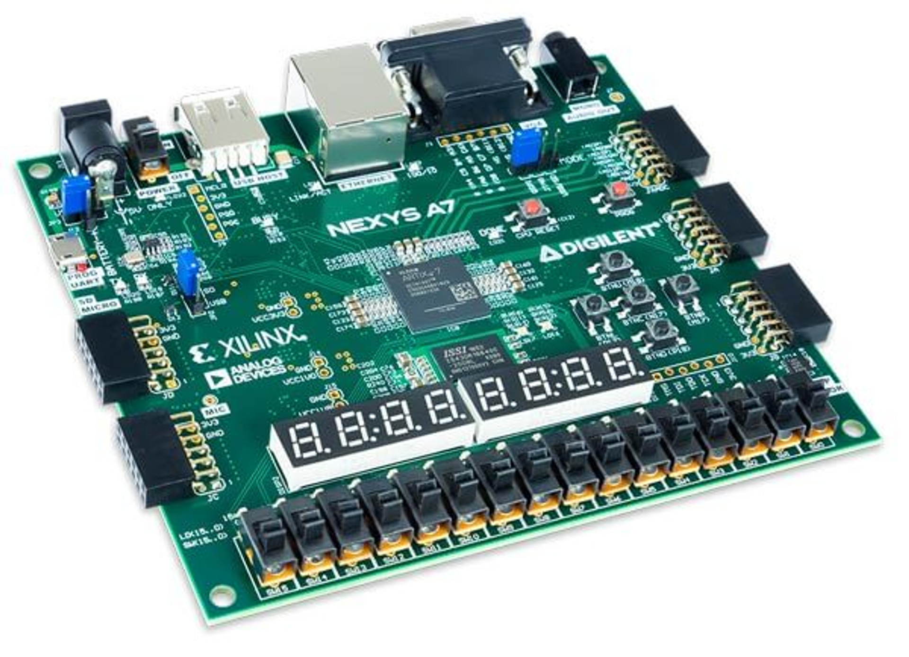

# DSDFinalProject : COLLECT 

## Introduction
In **COLLECT**, player must get five points by collecting green circles and avoiding red squares.  

**GOAL**: Player should collect circles, while red squares are also falling down.  

**Score**: Displays score on the board. 
          **Increments** when a green ball hits bat
           **Decrements** when a red square hits bat  

# Expected Behavior 

COLLECT was developed from the lab 6 baseline code. Once the game appears on the monitor, a starting audio will play. The player will press on BTNC to make 5 squares and 4 circles appear with different speeds and locations. The player will need to use the BTNR and BTNL button to move the bat across the screen to catch the green circle. If the player catches the green circle, then the score increments by one. If the player mistakenly catches the red square, then the score will decrement by one. Once the player gets five points, the player has won the game and can restart the game. However, when the game is in play and score reaches zero, the player has lost the game and must restart.  

## Attachments:
[NI Digilent Nexys A7-100T FPGA Trainer Board](https://digilent.com/shop/nexys-a7-fpga-trainer-board-recommended-for-ece-curriculum/)



[Pmod I2S](https://digilent.com/reference/pmod/pmodi2s/start?redirect=1)


## Video (Sneha)
 


[Audio for Music](https://www.youtube.com/shorts/x4X-i4yPIbg)

## Steps to Run Project (Sneha)
1. Download files: clk_wiz_0, clk_wiz_0_clk_wiz, vga_sync, bat_n_ball, leddec16,pong and opng_2.xdc  
2. Connect the monitor's HDMI cable to VGA. Also, connect the VGA to Nexys A7-100T board by powering with a USB cable and connecting aux cord to board.  
3. Connect the board via a PROG UART to computer to upload code. 
4. Run Synthesis 
5. Run Implementation
6. Generate bitstream, open hardware manager, and program device
7. Press down BTNC to begin game
   * Use the BTNL and BTNR to move the bat across the screen

## Modifications 
PLACE PICTURE ENTITY TREE

### Finite State Machine 
* The group set out to modify the logic of the code so that balls may be captured by the basket (formerly the bat), and respawn at the top of the screen.
* In order 

### Set of nine balls
* Nine balls were initialized with different X coordinates and a Y coordinate set to zero to display the balls at various positions across the top of the screen.
* A new variable called 'ball_on_screen' was created as a std_logic_vector(8 downto 0) to manage the visibility of the nine balls on the screen.
* For the balls to move vertically (in the y direction), all ball_x_motion values are set to zero, while ball_y_motion is determined by the specified ball_speed.

```vhdl
    SIGNAL start_pos : STD_LOGIC_VECTOR(10 downto 0);
    SIGNAL ball_x0 : STD_LOGIC_VECTOR(10 DOWNTO 0) := CONV_STD_LOGIC_VECTOR(100, 11);
    SIGNAL ball_x1 : STD_LOGIC_VECTOR(10 DOWNTO 0) := CONV_STD_LOGIC_VECTOR(350, 11);
    SIGNAL ball_x2 : STD_LOGIC_VECTOR(10 DOWNTO 0) := CONV_STD_LOGIC_VECTOR(450, 11);
    SIGNAL ball_x3 : STD_LOGIC_VECTOR(10 DOWNTO 0) := CONV_STD_LOGIC_VECTOR(550, 11);
    SIGNAL ball_x4 : STD_LOGIC_VECTOR(10 DOWNTO 0) := CONV_STD_LOGIC_VECTOR(650, 11);
    SIGNAL ball_x5 : STD_LOGIC_VECTOR(10 DOWNTO 0) := CONV_STD_LOGIC_VECTOR(750, 11);
    SIGNAL ball_y0, ball_y1, ball_y2,ball_y3,ball_y4,ball_y5 : STD_LOGIC_VECTOR(10 DOWNTO 0) := CONV_STD_LOGIC_VECTOR(0, 11);
    -- bat vertical position
    CONSTANT bat_y : STD_LOGIC_VECTOR(10 DOWNTO 0) := CONV_STD_LOGIC_VECTOR(500, 11);
    -- current ball motion - initialized to (+ ball_speed) pixels/frame in both X and Y directions
    SIGNAL ball_x_motion0, ball_x_motion1, ball_x_motion2,ball_x_motion3,ball_x_motion4,ball_x_motion5 : STD_LOGIC_VECTOR(10 DOWNTO 0) := CONV_STD_LOGIC_VECTOR(0,11);
    SIGNAL ball_y_motion0, ball_y_motion1, ball_y_motion2,ball_y_motion3,ball_y_motion4,ball_y_motion5 : STD_LOGIC_VECTOR(10 DOWNTO 0) := ball_speed;
    SIGNAL ball_on_screen : std_logic_vector(5 DOWNTO 0) := (OTHERS => '0')
```
### Pixel Encoding 
* Determines the colors of the balls and squares
* The ball_on(0), ball_on(2),ball_on(6) or ball_on(8) are green circles. ball_on(1), ball_on(3),ball_on(4),ball_on(5) and ball_on(7) are red
```vhdl
    red <=NOT (ball_on(0) or ball_on(2) or ball_on(6) or ball_on(8));  -- color setup
    green <= NOT (ball_on(1) or ball_on(3) or ball_on(4) or ball_on(5) or ball_on(7));
    blue <= NOT (bat_on or ball_on(1)OR ball_on(0)or ball_on(2)or ball_on(3)or ball_on(4)or   ball_on(5) or ball_on(6) or ball_on(7) or ball_on(8));
    
```
### Drawing Circles and Squares (Sneha)
* The group used the circle equation multiple times to draw each ball. The If/Else statement is used to turn the pixels on and off based on circle equation.
```vhdl
IF ball_on_screen(0) = '1' THEN 
        IF ((CONV_INTEGER(pixel_col) - CONV_INTEGER(ball_x0))**2 + (CONV_INTEGER(pixel_row) - CONV_INTEGER(ball_y0))**2) <= (bsize*bsize) THEN
                ball_on(0) <= '1';
            ELSE
                ball_on(0) <= '0';
        END IF;
    END IF;
```
* The group used the square equation multiple times to draw each square. The If/Else statement is used to turn the pixels on and off to create a square.
```vhdl
IF ball_on_screen(1) = '1' THEN 
            IF pixel_col >= ball_x1 - bsize AND
            pixel_col <= ball_x1 + bsize AND
                pixel_row >= ball_y1 - bsize AND
                pixel_row <= ball_y1 + bsize THEN
                   ball_on(1) <= '1';
            ELSE
                ball_on(1) <= '0';
            END IF;
        END IF;
```
### Respawn Logic
* Respawning in Random x-Positions.
```vhdl
randomizer: PROCESS IS
     VARIABLE rand : INTEGER;        
    BEGIN
        WAIT UNTIL (falling_edge(v_sync));
        rand := conv_integer(conv_std_logic_vector(counter, 11) XOR bat_x XOR pixel_row XOR pixel_col) mod 700 ;
        start_pos <= conv_std_logic_vector(rand,11);
```
* The group utilized code from the [Evade Game -- Final Project Work for Digital System Design](https://github.com/Aoli03/DSD-Final-Lab-Project/tree/main?tab=readme-ov-file) in order to set random x positions for the balls before they respawned.
* Assigned on the falling edge of every clock cycle.
* Mod division 700 prevents the balls from spawning off screen.

### Motion (Sneha)


### Ball-Basket Collisions
* The original code featured logic that would allow for the ball to bounce off of the bat. When this occured, the ball would continue it's motion in the opposite direction.
  ```vhdl
	-- allow for bounce off bat
        IF (ball_x + bsize/2) >= (bat_x - bat_w) AND
         (ball_x - bsize/2) <= (bat_x + bat_w) AND
             (ball_y + bsize/2) >= (bat_y - bat_h) AND
             (ball_y - bsize/2) <= (bat_y + bat_h) THEN
                ball_y_motion <= (NOT ball_speed) + 1; -- set vspeed to (- ball_speed) pixels
        END IF;
  ```
* This logic states that if the total distance between the center and edge of the ball is greater than that of the distance between the x position and width and y position and height of the bat, then the ball_y_motion will switch to the opposite direction (negative ball speed). 
* The group repurposed this If/Else Statement, but changed the logic so that they could end the ball's course accross the screen and restart it elsewhere.
  
  ```vhdl
	WHEN START_COLL =>
                IF (ball_x0 + bsize/2) >= (bat_x - bat_w) AND
                   (ball_x0 - bsize/2) <= (bat_x + bat_w) AND
                   (ball_y0 + bsize/2) >= (bat_y - bat_h) AND
                   (ball_y0 - bsize/2) <= (bat_y + bat_h) THEN
                           ball_on_screen(0) <= '0';
                           game_on(0) <= '0';
                           -- ...
  			   nx_state <= pr_state;
  ```
* After the collision, ball_on_screen and game_on become set to 0. Once this occurs, motion and the drawing of the ball will cease, and restart elsewhere, as specified by the temp variable.
  
### Ball-Wall Collisions 
* Once the ball reaches the bottom of screen (at 600 pixels), the ball wall will disappear
  *   The equation adds the current ball position and the radius of the ball.
  *   The ball_on_screen signal will be set to zero.
  *   The game_on(0) signal is set to '0'.
  **   The state returns to Enter_Game.
```vhdl
ELSIF ball_y0 + bsize >= 600 THEN -- if ball meets bottom wall
                           ball_on_screen(0) <= '0';
                           game_on(0) <= '0';
                           ps_state <= pr_state;
                           nx_state <= ENTER_GAME; 
```

 
### Corrected Hit_Counter Incrementation
* Counter will **increase**  when a green ball hits and **decrease** when red square hits the bat.
     * Checks to see if **hit_counter <= "0000000000000000"**  to see whether the state will 
     change to END_GAME 
     * If the **collision_detected** is true, then **hit_counter <= hit_counter - / + 
      "0000000000000001";**.
```vhdl
 IF (ball_x1 + bsize/2) >= (bat_x - bat_w) AND
                   (ball_x1 - bsize/2) <= (bat_x + bat_w) AND
                   (ball_y1 + bsize/2) >= (bat_y - bat_h) AND
                   (ball_y1 - bsize/2) <= (bat_y + bat_h) THEN
                           ball_on_screen(1) <= '0';
                           game_on(1) <= '0';
                           If hit_counter <= "0000000000000000" THEN
                                ps_state <= pr_state;
                                nx_state <= END_GAME;
                           ELSE
                                ps_state <= pr_state;
                                nx_state <= ENTER_GAME;
                           end if; 
                           if not collision_detected then
                           hit_counter <= hit_counter - "0000000000000001";
                           end if;
                           display_hits <= hit_counter;
                           collision_detected <= TRUE;          
                ELSIF ball_y1 + bsize >= 600 THEN -- if ball meets bottom wall
                           ball_on_screen(1) <= '0';
                           game_on(1) <= '0';
                           ps_state <= pr_state;
                           nx_state <= ENTER_GAME;       
                END IF;

```
* If the next tate becomes ENTER_GAME, then the collision_detected resets to False.   
```
IF nx_state = ENTER_GAME THEN
                    collision_detected <= FALSE;
                END IF;
```
### Sound Effects (Naz)
* The music was intended to operate similar to a MIDI player, drawing inspiration from the project [Tetris_Music](https://digilent.com/shop/nexys-a7-fpga-trainer-board-recommended-for-ece-curriculum/). This project utilized fixed notes and square waves, aligning with a similar logical framework.
* To create the sound effects for the game an online midi sequencer was utilized. This is the simple sound effect that the team decided on when the player start and ends the game: [Collect_Music](https://onlinesequencer.net/3988488).
* First File that was added to achieve that sound was ```game_sound_effects.vhd```.
* The code dynamically changes the note output signal to produce different notes when the sound is enabled, following a predefined duration for each note when the **sound_onn** is '1' as shown below:
```vhdl
 SIGNAL NOTE_DURATION : INTEGER := 4880000;  -- Duration for each note
    SIGNAL note_counter : INTEGER := 0;
BEGIN
    sound_effects : PROCESS (clk) 
    BEGIN
        IF rising_edge(clk) THEN
           if sound_onn <= '1'THEN 
                note_counter <= note_counter + 1;
                --nx_state <= pr_state;
                    IF note_counter < NOTE_DURATION THEN
                        note <= "01111";
                    Elsif note_counter >NOTE_DURATION AND note_counter < NOTE_DURATION *2 THEN
                        note <= "01000";
                  --...
```
* The code outputs the played notes and the aud_clk signal to the ```WaveGenerator.vhd``` file. This helps with processing, as that file functions as a clock divider, generating square waves that are subsequently transformed into audio signals.
```vhdl
square : PROCESS (aud_clk, tmp_clk, notee) 
		VARIABLE div_cnt : INTEGER := 0;
		VARIABLE max_count : INTEGER := 0;
	BEGIN
		CASE notee IS --When the clock speed is 48800hz
			WHEN "00000" => max_count := 0; --empty note
			WHEN "01111" => max_count := 52; --A#5 52
			WHEN "01000" => max_count := 55; --A5 55
			WHEN "00111" => max_count := 62; --G#5 62
			WHEN "01001" => max_count := 65; --G5 70
			WHEN OTHERS => 
		END CASE;
		IF (rising_edge(aud_clk)) THEN
			IF (div_cnt >= max_count) THEN
				tmp_clk <= NOT tmp_clk;
				div_cnt := 0;
			ELSE
				div_cnt := div_cnt + 2;
			END IF;
		END IF;

		IF (notee = "00000") THEN
			tonee <= "0000000000000000";
		ELSE
			CASE tmp_clk IS
				WHEN '0' => tonee <= TO_SIGNED(10240, 16);
				WHEN '1' => tonee <= TO_SIGNED( - 10240, 16);
			END CASE;
		END IF;
```
* The code Above:
  * Compares the 5-bit input to a 32-entry lookup table associating each bit combination with a note
  * Utilizes calculated values for each note in a clock divider.
  * Divides the input 48.8KHz clock by the corresponding table value.
  * Generates a temporary clock with the desired frequency.
  * Outputs a 16-bit signed value (either 10240 or -10240) based on the state of the new clock signal.
* The team specifically included only the four mentioned notes. 
* **tone** represents the resulting audio data output.
* Also ```ClkDiv2.vhd``` was incorporated to halve the 100 MHz system clock to 50 MHz. This was done to align with the lab 5 inspired sections of the code, which specifically required a 50 MHz clock.
```vhdl
BEGIN
	PROCESS (inclk)
	BEGIN
		IF rising_edge(inclk) THEN
			IF (counter >= count) THEN
				counter <= 0;
				clk_reg <= NOT(clk_reg);
			ELSE
				counter <= counter + 1;
			END IF;
		END IF;
	END PROCESS;
	Clk50 <= clk_reg;
```
### Modifications for Sound Effect Logic
* The modifications to the top-level module ```pong.vhd``` were inspired by ```siren.vhd``` from lab 5. This module preserves the timing and logic required for DAC operation. However, it incorporates additional logic and code for music generation and signal combination, similar to how data from the ```wail.vhd``` instance is sent to the DAC.
```vhdl
ENTITY pong IS
    PORT (
	--...
        dac_MCLK : OUT STD_LOGIC; -- outputs to PMODI2L DAC
	dac_LRCK : OUT STD_LOGIC;
	dac_SCLK : OUT STD_LOGIC;
	dac_SDIN : OUT STD_LOGIC
    ); 
END pong;
--...
    SIGNAL tcount : STD_LOGIC_VECTOR (19 DOWNTO 0);
    SIGNAL cnt : std_logic_vector(20 DOWNTO 0); -- counter to generate timing signals
    SIGNAL data_L, data_R : SIGNED (15 DOWNTO 0); -- 16-bit signed audio data
	SIGNAL dac_load_L, dac_load_R : STD_LOGIC; -- timing pulses to load DAC shift reg.
	SIGNAL slo_clk, sclk, audio_CLK : STD_LOGIC;
	SIGNAL tone: Signed (15 DOWNTO 0);
	SIGNAL clk_50mhz : std_logic;
--...
COMPONENT bat_n_ball IS
        PORT (
	--...
            sound: OUT STD_LOGIC
        );
 COMPONENT CLKDiv2 IS
		PORT (
			inclk : IN std_logic;
			Clk50 : OUT std_logic
		);
 COMPONENT WaveGenerator IS
		PORT (
			aud_clk : IN std_logic;
			notee : IN std_logic_vector (4 DOWNTO 0);
			tonee : OUT signed (15 DOWNTO 0)
		);
--...
COMPONENT dac_if IS
		PORT (
			SCLK : IN STD_LOGIC;
			L_start : IN STD_LOGIC;
			R_start : IN STD_LOGIC;
			L_data : IN signed (15 DOWNTO 0);
			R_data : IN signed (15 DOWNTO 0);
			SDATA : OUT STD_LOGIC
		);
	END COMPONENT;
COMPONENT game_sound_effects IS
    PORT (
        clk : IN STD_LOGIC;  -- Main clock input
        aud_clk : OUT STD_LOGIC;  -- Clock signal for WaveGenerator
        note : OUT STD_LOGIC_VECTOR(4 DOWNTO 0); -- Control signal for notes
        sound_onn:IN STD_LOGIC
        --tone : OUT signed (15 DOWNTO 0)
    );
      END COMPONENT;
--...
tim_pr : PROCESS (clk_50MHz) is
	BEGIN
		if rising_edge(clk_50MHz) then
		IF (tcount(9 DOWNTO 0) >= X"00F") AND (tcount(9 DOWNTO 0) < X"02E") THEN
			dac_load_L <= '1';
		ELSE
			dac_load_L <= '0';
		END IF;
		IF (tcount(9 DOWNTO 0) >= X"20F") AND (tcount(9 DOWNTO 0) < X"22E") THEN
			dac_load_R <= '1';
		ELSE
			dac_load_R <= '0';
		END IF;
		tcount <= tcount + 1;
	end if;
END PROCESS;
    
    dac_MCLK <= NOT tcount(1); -- DAC master clock (12.5 MHz)
	audio_CLK <= tcount(9); -- audio sampling rate (48.8 kHz)
	dac_LRCK <= audio_CLK; -- also sent to DAC as left/right clock
	sclk <= tcount(4); -- serial data clock (1.56 MHz)
	dac_SCLK <= sclk; -- also sent to DAC as SCLK
	slo_clk <= tcount(19); -- clock to control wailing of tone (47.6 Hz)
    led_mpx <= tcount(19 DOWNTO 17); -- 7-seg multiplexing clock    
    add_bb : bat_n_ball
    PORT MAP(
-...
        sound => sound
        );
--...
 clk50 : ClkDiv2
	PORT MAP(
		inclk => clk_in, 
		Clk50 => clk_50mhz
		);
 music : game_sound_effects
    PORT MAP(
        clk => clk_50mhz,
        aud_clk => aud_clk,
        note => note, 
        sound_onn => sound
        --tone => data_L
    );
    dac : dac_if
		PORT MAP(
			SCLK => sclk, -- instantiate parallel to serial DAC interface
			L_start => dac_load_L, 
			R_start => dac_load_R, 
			L_data => data_L, 
			R_data => data_R, 
			SDATA => dac_SDIN
		);
   a1 : WaveGenerator
		PORT MAP(
			aud_clk => audio_CLK, 
			notee => note, 
			tonee => tone
		);
		data_L <= tone;
		data_R <= tone;
```
* The majority of modifications, distinct from those in lab 5, primarily involve the routing of input and output variables.
* A std_logic signal named 'sound' was incorporated into the ``bat_n_ball.vhd``` file. This signal is set to '1' when the game is turning on or ending.
```vhd
WHEN END_GAME =>
                ball_on_screen <= "000000000";
                game_on <= "000000000";
                sound_on <= '1';
                sound <= sound_on;
                --ps_state <= pr_state;
                IF serve = '1' THEN
                    nx_state <= ENTER_GAME;
                END IF;
``` 
* ```dac_if.vhd``` was also included from lab 5 without any alterations.
* The team successfully achieved the correct notes for the sound effects to play at the beginning of the game, as demonstrated in the video
  
## Process Summary (Sneha)
### Challenges 
#### Motion
#### Respawn
* Although the team eventually succeeded in getting the balls to respawn correctly, initially, they encountered significant difficulty in achieving this.
* They made multiple attempts and tried various codes before achieving success.
* One of the respawn attempts involved the following code:
```vhd
WHEN START_COLL =>
            --collision cases
                IF (ball_x0 + bsize/2) >= (bat_x - bat_w) AND
                   (ball_x0 - bsize/2) <= (bat_x + bat_w) AND
                   (ball_y0 + bsize/2) >= (bat_y - bat_h) AND
                   (ball_y0 - bsize/2) <= (bat_y + bat_h) THEN
                           ball_on_screen(1) <= '0';
                           hit_counter <= hit_counter + "0000000000000001";
                           display_hits <= hit_counter;
                           ball_x0 <= conv_std_logic_vector(counter1 * 5 mod 700, 10);
                           ball_y0 <= CONV_STD_LOGIC_VECTOR(0, 11);
                           ball_on_screen(0) <= '1';      
                           --nx_state <= ENTER_GAME;
                ELSIF ball_y0 + bsize >= 600 THEN -- if ball meets bottom wall
                           ball_on_screen(0) <= '0';
                           ball_x0 <= conv_std_logic_vector(counter1 * 5 mod 700, 10);
                           ball_y0 <= CONV_STD_LOGIC_VECTOR(0, 11);
                           ball_on_screen(0) <= '1';      
                END IF;
                
                IF (ball_x1 + bsize/2) >= (bat_x - bat_w) AND
                   (ball_x1 - bsize/2) <= (bat_x + bat_w) AND
                   (ball_y1 + bsize/2) >= (bat_y - bat_h) AND
                   (ball_y1 - bsize/2) <= (bat_y + bat_h) THEN
                           ball_on_screen(1) <= '0';
                           hit_counter <= hit_counter - "0000000000000001";
                           display_hits <= hit_counter;
                           ball_x1 <= conv_std_logic_vector(counter2 * 5 mod 700, 10);
                           ball_y1 <= CONV_STD_LOGIC_VECTOR(0, 11);
                           --nx_state <= ENTER_GAME;
                ELSIF ball_y1 + bsize >= 600 THEN -- if ball meets bottom wall
                           ball_on_screen(1) <= '0';
                           ball_x1 <= conv_std_logic_vector(counter2 * 5 mod 700, 10);
                           ball_y1 <= CONV_STD_LOGIC_VECTOR(0, 11);
                           --nx_state <= ENTER_GAME;    
                ElsIF hit_counter <= "0000000000000000" THEN
                       ball_on_screen <= "000";
                       game_on <= '0'; 
                       nx_state <= ENTER_GAME;   
                END IF;    
            END CASE;
```
* this approach did not yield the desired outcome. Instead, it caused the ball to spawn randomly while descending, leading to erratic movements on the screen, contrary to the team's intentions.
* Despite trying multiple other approaches, they encountered similar issues with the ball spawning randomly or unexpectedly disappearing during gameplay. These repeated failures indicated that they were approaching the problem incorrectly.
* In their attempt to rectify the issue, the team inadvertently worsened the situation, resulting in the balls no longer disappearing after collisions using the code below:
```vhd
WHEN START_COLL =>
            --collision cases
                IF (ball_x0 + bsize/2) >= (bat_x - bat_w) AND
                   (ball_x0 - bsize/2) <= (bat_x + bat_w) AND
                   (ball_y0 + bsize/2) >= (bat_y - bat_h) AND
                   (ball_y0 - bsize/2) <= (bat_y + bat_h) THEN
                           ball_on_screen(1) <= '0';
                           hit_counter <= hit_counter + "0000000000000001";
                           display_hits <= hit_counter;
                           ball_x0 <= conv_std_logic_vector(100, 10);
                           ball_y0 <= CONV_STD_LOGIC_VECTOR(0, 11);
                           ball_on_screen(0) <= '1';      
                           --nx_state <= ENTER_GAME;
                ELSIF ball_y0 + bsize >= 600 THEN -- if ball meets bottom wall
                           ball_on_screen(0) <= '0';
                           ball_x0 <= conv_std_logic_vector(500, 10);
                           ball_y0 <= CONV_STD_LOGIC_VECTOR(0, 11);
                           ball_on_screen(0) <= '1';      
                END IF;
                
                IF (ball_x1 + bsize/2) >= (bat_x - bat_w) AND
                   (ball_x1 - bsize/2) <= (bat_x + bat_w) AND
                   (ball_y1 + bsize/2) >= (bat_y - bat_h) AND
                   (ball_y1 - bsize/2) <= (bat_y + bat_h) THEN
                           ball_on_screen(1) <= '0';
                           hit_counter <= hit_counter - "0000000000000001";
                           display_hits <= hit_counter;
                           ball_x1 <= conv_std_logic_vector(500, 10);
                           ball_y1 <= CONV_STD_LOGIC_VECTOR(0, 11);
                           --nx_state <= ENTER_GAME;
                ELSIF ball_y1 + bsize >= 600 THEN -- if ball meets bottom wall
                           ball_on_screen(1) <= '0';
                           ball_x1 <= conv_std_logic_vector(700, 10);
                           ball_y1 <= CONV_STD_LOGIC_VECTOR(0, 11);
                           --nx_state <= ENTER_GAME;    
                ElsIF hit_counter <= "0000000000000000" THEN
                       ball_on_screen <= "000";
                       game_on <= '0'; 
                       nx_state <= ENTER_GAME;   
                END IF;    
            END CASE;
```
* After numerous trial and error attempts, they eventually arrived at the correct respawning code. This was achieved by refining the FSM logic, enabling the balls to respawn in different locations successfully.
  
#### Hit_Counter Incrementation

#### Sound Effects
* Although the sound effects played correctly at the beginning of the game, numerous challenges arose in getting the code to produce the appropriate sound effects for the game's ending (whether winning or losing).
 *  Instead, a very delayed humming sound would play, and it prevented the correct sound effect from playing when restarting the game
* The team attempted various approaches to enable the sound to play for the game's ending, but unfortunately, none were successful.
* One notable example was the team's attempt to utilize a Finite State Machine (FSM) to send the notes to the WaveGeneration file:
```vhdl
       CASE pr_state IS
                WHEN PLAY_A5_SHARP =>
                    IF note_counter >= note_duration * 2 THEN
                        nx_state <= PLAY_A5;
                    ELSIF note_counter > 0 THEN 
                        note <= "01111"; -- A5#
                        nx_state <= PLAY_A5_SHARP;
                    ELSE
                        note <= "00000";
                        nx_state <= PLAY_A5_SHARP;
                   END IF;
                WHEN PLAY_A5 =>
                    IF note_counter >= note_duration * 3 THEN
                        nx_state <= PLAY_G5_SHARP;
                    ELSE 
                        note <= "01000"; -- A5
                        nx_state <= PLAY_A5;
                    END IF;
                    
                WHEN PLAY_G5_SHARP =>
                    IF note_counter >= note_duration * 4 THEN
                        nx_state <= PLAY_G5;
                    ELSE 
                        note <= "00111"; -- A5
                        nx_state <= PLAY_G5_SHARP;
                    END IF;
                    
                WHEN PLAY_G5 =>
                    IF note_counter >= note_duration * 5 THEN
                        nx_state <= END_SOUND;
                    ELSE 
                        note <= "01001"; -- G5 -- A5
                        nx_state <= PLAY_G5;
                    END IF;
                WHEN END_SOUND =>
                     Stop playing sound effects
                    note <= "00000";
            END CASE;
```
* However, this approach yielded little progress and did not solve the problem. Due to time constraints, the team ultimately decided to allow the music to play only at the very beginning of the game.


## Important Ports and Signals (Pre)
* ```ball_on_screen(8 downto 0)```, ```ball_on(8 downto 0)```, ```game_on(8 downto 0)```: controls individual balls' pixels, drawing, and motions
* ```collision_detected```: boolean signal that toggles "true" when a collision occurs, flag that prevents hit_counter from incrementing more than once after a collision occurs.
* ```pr_state```,```nx_state```: signals that are assigned states after every clock cycle.
* ```display_hits```, ```hit_counter```: the port that communicates with leddec regarding the number of points a player has received, corresponding signal that counts hits based on the occurence of collisions between the balls and bat

## Contributions 
* Sneha was responsible for the creation of multiple balls and aided with the drawing and respawn logic.
* Nazanin was responsible for the music, debugged the hit_counter signal so that it would increment correctly within the FSM, and implemented drawing logic for the balls.
* Prerana worked on the conception of the newly implemented motion logic FSM and contributed to the development of the respawn logic.
