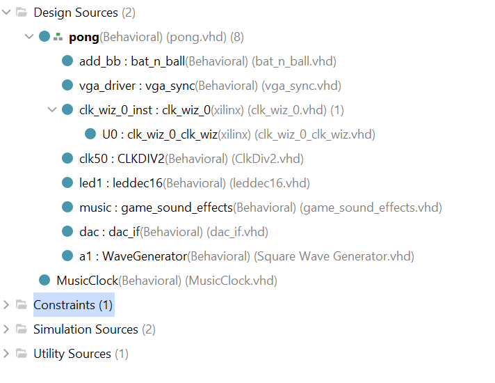
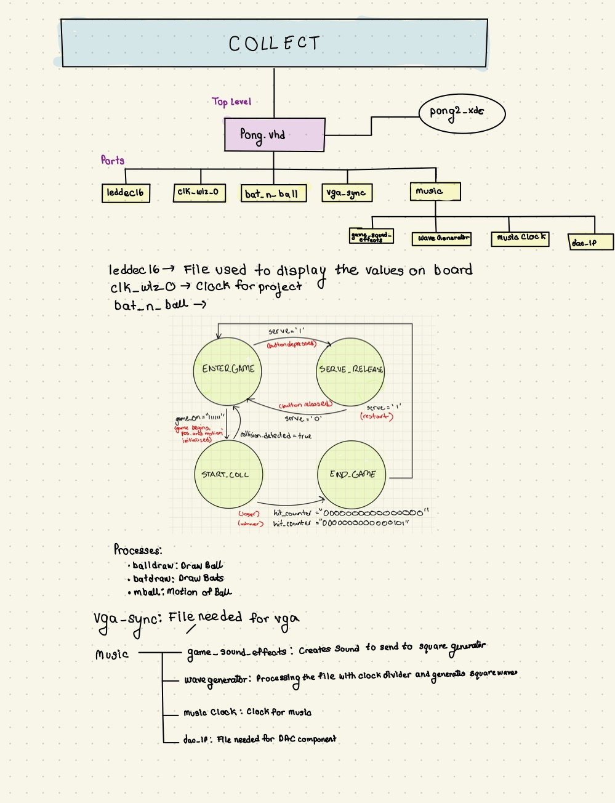

# DSD Final Project : COLLECT 

## Introduction
In **COLLECT**, player must get five points by collecting green circles and avoiding red squares.  

**GOAL**: Player should collect circles, while red squares are also falling down.  

**Score**: Displays score on the board. 
          **Increments** when a green ball hits bat
           **Decrements** when a red square hits bat  

# Expected Behavior 

COLLECT was developed from the lab 6 baseline code. Once the game appears on the monitor, a starting audio will play. The player will press on BTNC to make 5 squares and 4 circles appear with different speeds and locations. The player will need to use the BTNR and BTNL button to move the bat across the screen to catch the green circle. If the player catches the green circle, then the score increments by one. If the player mistakenly catches the red square, then the score will decrement by one. Once the player gets five points, the player has won the game and can restart the game. However, when the game is in play and score reaches zero, the player has lost the game and must restart.  

## Attachments:
[NI Digilent Nexys A7-100T FPGA Trainer Board](https://digilent.com/shop/nexys-a7-fpga-trainer-board-recommended-for-ece-curriculum/)


[Pmod I2S](https://digilent.com/reference/pmod/pmodi2s/start?redirect=1)


## Video
 


[Audio for Music](https://www.youtube.com/shorts/x4X-i4yPIbg)

## Steps to Run Project
1. Download files: clk_wiz_0, clk_wiz_0_clk_wiz, vga_sync, bat_n_ball, leddec16,pong and pong_2.xdc  
2. Connect the monitor's HDMI cable to VGA. Also, connect the VGA to Nexys A7-100T board by powering with a USB cable and connecting aux cord to board.  
3. Connect the board via a PROG UART to computer to upload code. 
4. Run Synthesis 
5. Run Implementation
6. Generate bitstream, open hardware manager, and program device
7. Press down BTNC to begin game
   * Use the BTNL and BTNR to move the bat across the screen


## Modifications 

### Set of Nine Balls
* In the original Pong lab, ```ball_on``` and ```game_on``` were signals responsible for the drawing and positioning of one ball in the bat_n_ball component file.
* For the group's purposes, they required several balls to be created, and spawn randomly and independently based on any collision they had.
* In order to do this, the group changed ```ball_on``` and ```game_on``` to vectors with lengths of 9 bits, each of those bits corresponding to x and y coordinate signals that the group created for each ball.
  ```vhdl
	SIGNAL ball_on : STD_LOGIC_VECTOR (8 DOWNTO 0):= (OTHERS => '0'); -- indicates whether ball is at current pixel position
  	SIGNAL game_on : STD_LOGIC_VECTOR (8 DOWNTO 0) := "000000000"; -- indicates whether ball is in play
  ```
* A new signal called ```ball_on_screen``` was created also created as a vector of length 9 bits to manage the visibility of the nine balls on the screen.
  ```vhdl
	SIGNAL ball_on_screen : STD_LOGIC_VECTOR (8 DOWNTO 0):= (OTHERS => '0')
  ```
* As mentioned previously, several signals were created corresponding to various x and y coordinates, each set of which corresponded to its own ball.
  ```vhdl
	 SIGNAL ball_x0 : STD_LOGIC_VECTOR(10 DOWNTO 0) := CONV_STD_LOGIC_VECTOR(100, 11); --- each x-coordinate has its own signal
  	---...
  	 SIGNAL ball_y0, ball_y1, ball_y2,ball_y3,ball_y4,ball_y5,ball_y6,ball_y7,ball_y8 : STD_LOGIC_VECTOR(10 DOWNTO 0) := CONV_STD_LOGIC_VECTOR(0, 11); -- all y-coordinates have the same initial position
  ```
  
### Pixel Encoding 
* Determines the colors of the balls and squares
* The ball_on(0), ball_on(2),ball_on(6) or ball_on(8) are green circles. ball_on(1), ball_on(3),ball_on(4),ball_on(5) and ball_on(7) are red
```vhdl
    red <=NOT (ball_on(0) or ball_on(2) or ball_on(6) or ball_on(8));  -- color setup
    green <= NOT (ball_on(1) or ball_on(3) or ball_on(4) or ball_on(5) or ball_on(7));
    blue <= NOT (bat_on or ball_on(1)OR ball_on(0)or ball_on(2)or ball_on(3)or ball_on(4)or   ball_on(5) or ball_on(6) or ball_on(7) or ball_on(8));
    
```
### Drawing Circles and Squares
* The group utilized the drawing logic provided to them in the Pong and Bouncing Ball labs in order to create various shapes of balls.
```vhdl
IF ball_on_screen(0) = '1' THEN 
        IF ((CONV_INTEGER(pixel_col) - CONV_INTEGER(ball_x0))**2 + (CONV_INTEGER(pixel_row) - CONV_INTEGER(ball_y0))**2) <= (bsize*bsize) THEN -- circle
                ball_on(0) <= '1';
            ELSE
                ball_on(0) <= '0';
        END IF;
    END IF;
--...
IF ball_on_screen(1) = '1' THEN -- 
            IF pixel_col >= ball_x1 - bsize AND
            pixel_col <= ball_x1 + bsize AND
                pixel_row >= ball_y1 - bsize AND
                pixel_row <= ball_y1 + bsize THEN -- squares
                   ball_on(1) <= '1';
            ELSE
                ball_on(1) <= '0';
            END IF;
        END IF;
```
* The group used a nested for loop, the outer statement having the condition that ```ball_on_screen(i) = "1"``` in order for the ball to be drawn within the given constraints of the inner statement. As mentioned, these drawings occur when the ball is initially spawned once serve is released and game_on <= "111111111" and when it is respawned.
  
### Finite State Machine 
* The group set out to modify the logic of the code so that balls may be captured by the basket (formerly the bat), and respawn at the top of the screen.
* In order to be able to repeatedly verify that a ball needed to be respawned after turning off, the group implemented a finite state machine, which would return to the **ENTER_GAME** state once a collision occured, and check for conditions that allow the ball to respawn.
* To do this, the group repurposed the ```mball``` process from the Pong lab, transitioning between states after certain occurences.
	* For example, when BTNC is depressed, serve = '1'. In our, FSM this results in the transition between the states **ENTER_GAME** and **SERVE_RELEASE**.
   
     ```vhdl
	CASE pr_state IS 
 		WHEN ENTER_GAME => 
			IF serve = '1' THEN
                    		nx_state <= SERVE_RELEASE;	
     ``` 	
 	* Once ```pr_state <= SERVE_RELEASE``` and the button is released, the ```hit_counter``` is initialized, ```game_on <= "111111111"```, and ```nx_state <= ENTER_GAME```
    ```vhdl
    	WHEN SERVE_RELEASE =>
     		IF serve = '0' THEN
     			hit_counter <= "0000000000000000";
     			display_hits <= hit_counter;
     			game_on(0) <= '1';
     			-- ...
     			nx_state <= ENTER_GAME;
    ```
  	* In **ENTER_GAME**, ```ball_on_screen => "111111111"``` and all the motion vectors are initialized as a result of game_on being completely on. The FSM then transitions to the **START_COLL** state.
  	* In **START_COLL**, the FSM checks for collisions that occur betwween the ball and the basket or wall. When a collision occurs, the FSM either transitions to **ENTER_GAME** to respawn with ```ps_state <= pr_state```, or **END_GAME** once the hit_counter reaches either an upper bound or a lower bound of zero.
  	* In **END_GAME**, all logic ceases unless BTNC is depressed, which restarts the FSM at the **ENTER_GAME** state once more
* In order to transition the next state to the current state, the group implemented a clock cycle function that would allow for the state to transition on the rising edge of every clock cycle.
  ```vhdl
	BEGIN
        ball_speed <= "00000000010";
        WAIT UNTIL rising_edge(v_sync);
            pr_state <= nx_state;
  ``` 
 	
### Respawn Logic
* The main purpose of the implementation of an FSM by the group was to correct their respawn logic. Once the ball ceased motion and the pixels were turned off, the ```mball``` process didn't go back and check the previously stated conditions that allowed for the ball to respawn.
* The group utilized a seperate set of If/Else statements, and manipulated the temp variables in order to achieve the desired outcome.
 	* During the **START_COLL** state, once a collision was detected the ball_on_screen and game_on signals would turn to zero in the positions corresponding to the coordinates of the ball that experienced collision.
  		* ```game_on(i) <= '0'``` would result in the reset of the x and y positions of the ball via the temp variable, the implementation of which the group left, outside of the FSM.
    		```vhdl
			temp := ('0' & ball_y0) + (ball_y_motion0(10) & ball_y_motion0);
                        IF game_on(0) = '0' THEN
                            ball_y0 <= CONV_STD_LOGIC_VECTOR(0, 11);
                            ball_x0 <= conv_std_logic_vector(conv_integer(start_pos) * 5 mod 700, 11);
                        ELSIF temp(11) = '1' THEN
                            ball_y0 <= (OTHERS => '0');
                        ELSE ball_y0 <= temp(10 DOWNTO 0); -- 9 downto 0
                        END IF;	
    		``` 
  		* Because, ```game_on(i) <= '0' ``` ```ball_on_screen(i) <= '0'``` and ```ps_state <= START_COLL```, the FSM finds that condition and toggles the two signals, as well as resets the motion of the ball, before returning to the **START_COLL** state.
   ```vhdl
	ELSIF (game_on(0) = '0' AND ball_on_screen(0) = '0' AND ps_state = START_COLL) THEN
                    game_on(0) <= '1';
                    ball_on_screen(0) <= '1';
                    ball_y_motion0 <= ball_speed + 3;
                    nx_state <= START_COLL;
        ELSE nx_state <= ENTER_GAME;
        END IF; 
   ```
     	 
* The group also utilized code from the [Evade Game -- Final Project Work for Digital System Design](https://github.com/Aoli03/DSD-Final-Lab-Project/tree/main?tab=readme-ov-file) in order to set random x positions for the balls before they respawned.
```vhdl
randomizer: PROCESS IS
     VARIABLE rand : INTEGER;        
    BEGIN
        WAIT UNTIL (falling_edge(v_sync));
        rand := conv_integer(conv_std_logic_vector(counter, 11) XOR bat_x XOR pixel_row XOR pixel_col) mod 700 ;
        start_pos <= conv_std_logic_vector(rand,11);
```
* These positions were assigned on every clock cycle's falling edge, before the state transitioned from ```pr_state <= nx_state```.
* Mod division 700 prevents the balls from spawning off screen.

### Motion
* The motion logic utilized from the group was once again from the Pong lab, however it was manipulated to better suit the purposed of the *Collect* gameplay.
 * For example, x-direction motion was left out entirely, and only y-direction code was utilized in the ```mball``` process.
 * While the game_on signal was originally utilized in the Pong lab for resetting the position of the ball, the group also utilized this signal to reset the motion of the ball at the point of respawning.

### Ball-Basket Collisions
* The original code featured logic that would allow for the ball to bounce off of the bat. When this occured, the ball would continue it's motion in the opposite direction.
  ```vhdl
	-- allow for bounce off bat
        IF (ball_x + bsize/2) >= (bat_x - bat_w) AND
         (ball_x - bsize/2) <= (bat_x + bat_w) AND
             (ball_y + bsize/2) >= (bat_y - bat_h) AND
             (ball_y - bsize/2) <= (bat_y + bat_h) THEN
                ball_y_motion <= (NOT ball_speed) + 1; -- set vspeed to (- ball_speed) pixels
        END IF;
  ```
* This logic states that if the total distance between the center and edge of the ball is greater than that of the distance between the x position and width and y position and height of the bat, then the ball_y_motion will switch to the opposite direction (negative ball speed). 
* The group repurposed this If/Else Statement, but changed the logic so that they could end the ball's course across the screen and restart it elsewhere.
  
  ```vhdl
	WHEN START_COLL =>
                IF (ball_x0 + bsize/2) >= (bat_x - bat_w) AND
                   (ball_x0 - bsize/2) <= (bat_x + bat_w) AND
                   (ball_y0 + bsize/2) >= (bat_y - bat_h) AND
                   (ball_y0 - bsize/2) <= (bat_y + bat_h) THEN
                           ball_on_screen(0) <= '0';
                           game_on(0) <= '0';
                           -- ...
  			   nx_state <= pr_state;
  ```
* After the collision, ball_on_screen and game_on become set to 0. Once this occurs, motion and the drawing of the ball will cease, and restart elsewhere, as specified by the temp variable.
  
### Ball-Wall Collisions 
* The group wanted to extend the respawn logic to when the balls went off of the screen as well.
* To do this they utilized the logic provided in the original Pong lab for when the ball meets the bottom wall
    ```vhdl
	ELSIF ball_y0 + bsize >= 600 THEN -- if ball meets bottom wall
                           ball_on_screen(0) <= '0';
                           game_on(0) <= '0';
                           ps_state <= pr_state;
                           nx_state <= ENTER_GAME; 
   ```
* This logic dictates that if the sum of the y coordinate and the radius of the ball is greater than the screen height, the signals controlling the movement and appearance of the ball will become 0, and the next state will be **ENTER_GAME**.
 
### Hit_Counter Incrementation
* The group wanted the signal ```hit_counter``` to increment and decrement upon the collision between ball and basket.
*  The group implemented a boolean flag ```collision_detected```, which would become true immediately after a ball-basket collision, and false otherwise
```vhdl 
	if not collision_detected then
		hit_counter <= hit_counter - "0000000000000001";
	end if;
		display_hits <= hit_counter;
		collision_detected <= TRUE;          
```
* If the next state becomes ENTER_GAME, then the collision_detected resets to False.   
```
IF nx_state = ENTER_GAME THEN
                    collision_detected <= FALSE;
END IF;
```
### Sound Effects 
* The music was intended to operate similar to a MIDI player, drawing inspiration from the project [Tetris_Music](https://digilent.com/shop/nexys-a7-fpga-trainer-board-recommended-for-ece-curriculum/). This project utilized fixed notes and square waves, aligning with a similar logical framework.
* To create the sound effects for the game an online midi sequencer was utilized. This is the simple sound effect that the team decided on when the player start and ends the game: [Collect_Music](https://onlinesequencer.net/3988488).
* First File that was added to achieve that sound was ```game_sound_effects.vhd```.
* The code dynamically changes the note output signal to produce different notes when the sound is enabled, following a predefined duration for each note when the **sound_onn** is '1' as shown below:
```vhdl
 SIGNAL NOTE_DURATION : INTEGER := 4880000;  -- Duration for each note
    SIGNAL note_counter : INTEGER := 0;
BEGIN
    sound_effects : PROCESS (clk) 
    BEGIN
        IF rising_edge(clk) THEN
           if sound_onn <= '1'THEN 
                note_counter <= note_counter + 1;
                --nx_state <= pr_state;
                    IF note_counter < NOTE_DURATION THEN
                        note <= "01111";
                    Elsif note_counter >NOTE_DURATION AND note_counter < NOTE_DURATION *2 THEN
                        note <= "01000";
                  --...
```
* The code outputs the played notes and the aud_clk signal to the ```WaveGenerator.vhd``` file. This helps with processing, as that file functions as a clock divider, generating square waves that are subsequently transformed into audio signals.
```vhdl
square : PROCESS (aud_clk, tmp_clk, notee) 
		VARIABLE div_cnt : INTEGER := 0;
		VARIABLE max_count : INTEGER := 0;
	BEGIN
		CASE notee IS --When the clock speed is 48800hz
			WHEN "00000" => max_count := 0; --empty note
			WHEN "01111" => max_count := 52; --A#5 52
			WHEN "01000" => max_count := 55; --A5 55
			WHEN "00111" => max_count := 62; --G#5 62
			WHEN "01001" => max_count := 65; --G5 70
			WHEN OTHERS => 
		END CASE;
		IF (rising_edge(aud_clk)) THEN
			IF (div_cnt >= max_count) THEN
				tmp_clk <= NOT tmp_clk;
				div_cnt := 0;
			ELSE
				div_cnt := div_cnt + 2;
			END IF;
		END IF;

		IF (notee = "00000") THEN
			tonee <= "0000000000000000";
		ELSE
			CASE tmp_clk IS
				WHEN '0' => tonee <= TO_SIGNED(10240, 16);
				WHEN '1' => tonee <= TO_SIGNED( - 10240, 16);
			END CASE;
		END IF;
```
* The code Above:
  * Compares the 5-bit input to a 32-entry lookup table associating each bit combination with a note
  * Utilizes calculated values for each note in a clock divider.
  * Divides the input 48.8KHz clock by the corresponding table value.
  * Generates a temporary clock with the desired frequency.
  * Outputs a 16-bit signed value (either 10240 or -10240) based on the state of the new clock signal.
* The team specifically included only the four mentioned notes. 
* **tone** represents the resulting audio data output.
* Also ```ClkDiv2.vhd``` was incorporated to halve the 100 MHz system clock to 50 MHz. This was done to align with the lab 5 inspired sections of the code, which specifically required a 50 MHz clock.
```vhdl
BEGIN
	PROCESS (inclk)
	BEGIN
		IF rising_edge(inclk) THEN
			IF (counter >= count) THEN
				counter <= 0;
				clk_reg <= NOT(clk_reg);
			ELSE
				counter <= counter + 1;
			END IF;
		END IF;
	END PROCESS;
	Clk50 <= clk_reg;
```
### Modifications for Sound Effect Logic
* The modifications to the top-level module ```pong.vhd``` were inspired by ```siren.vhd``` from lab 5. This module preserves the timing and logic required for DAC operation. However, it incorporates additional logic and code for music generation and signal combination, similar to how data from the ```wail.vhd``` is sent to the DAC.
```vhdl
ENTITY pong IS
    PORT (
	--...
        dac_MCLK : OUT STD_LOGIC; -- outputs to PMODI2L DAC
	dac_LRCK : OUT STD_LOGIC;
	dac_SCLK : OUT STD_LOGIC;
	dac_SDIN : OUT STD_LOGIC
    ); 
END pong;
--...
    SIGNAL tcount : STD_LOGIC_VECTOR (19 DOWNTO 0);
    SIGNAL cnt : std_logic_vector(20 DOWNTO 0); -- counter to generate timing signals
    SIGNAL data_L, data_R : SIGNED (15 DOWNTO 0); -- 16-bit signed audio data
	SIGNAL dac_load_L, dac_load_R : STD_LOGIC; -- timing pulses to load DAC shift reg.
	SIGNAL slo_clk, sclk, audio_CLK : STD_LOGIC;
	SIGNAL tone: Signed (15 DOWNTO 0);
	SIGNAL clk_50mhz : std_logic;
--...
COMPONENT bat_n_ball IS
        PORT (
	--...
            sound: OUT STD_LOGIC
        );
 COMPONENT CLKDiv2 IS
		PORT (
			inclk : IN std_logic;
			Clk50 : OUT std_logic
		);
 COMPONENT WaveGenerator IS
		PORT (
			aud_clk : IN std_logic;
			notee : IN std_logic_vector (4 DOWNTO 0);
			tonee : OUT signed (15 DOWNTO 0)
		);
--...
COMPONENT dac_if IS
		PORT (
			SCLK : IN STD_LOGIC;
			L_start : IN STD_LOGIC;
			R_start : IN STD_LOGIC;
			L_data : IN signed (15 DOWNTO 0);
			R_data : IN signed (15 DOWNTO 0);
			SDATA : OUT STD_LOGIC
		);
	END COMPONENT;
COMPONENT game_sound_effects IS
    PORT (
        clk : IN STD_LOGIC;  -- Main clock input
        aud_clk : OUT STD_LOGIC;  -- Clock signal for WaveGenerator
        note : OUT STD_LOGIC_VECTOR(4 DOWNTO 0); -- Control signal for notes
        sound_onn:IN STD_LOGIC
        --tone : OUT signed (15 DOWNTO 0)
    );
      END COMPONENT;
--...
tim_pr : PROCESS (clk_50MHz) is
	BEGIN
		if rising_edge(clk_50MHz) then
		IF (tcount(9 DOWNTO 0) >= X"00F") AND (tcount(9 DOWNTO 0) < X"02E") THEN
			dac_load_L <= '1';
		ELSE
			dac_load_L <= '0';
		END IF;
		IF (tcount(9 DOWNTO 0) >= X"20F") AND (tcount(9 DOWNTO 0) < X"22E") THEN
			dac_load_R <= '1';
		ELSE
			dac_load_R <= '0';
		END IF;
		tcount <= tcount + 1;
	end if;
END PROCESS;
    
    dac_MCLK <= NOT tcount(1); -- DAC master clock (12.5 MHz)
	audio_CLK <= tcount(9); -- audio sampling rate (48.8 kHz)
	dac_LRCK <= audio_CLK; -- also sent to DAC as left/right clock
	sclk <= tcount(4); -- serial data clock (1.56 MHz)
	dac_SCLK <= sclk; -- also sent to DAC as SCLK
	slo_clk <= tcount(19); -- clock to control wailing of tone (47.6 Hz)
    led_mpx <= tcount(19 DOWNTO 17); -- 7-seg multiplexing clock    
    add_bb : bat_n_ball
    PORT MAP(
-...
        sound => sound
        );
--...
 clk50 : ClkDiv2
	PORT MAP(
		inclk => clk_in, 
		Clk50 => clk_50mhz
		);
 music : game_sound_effects
    PORT MAP(
        clk => clk_50mhz,
        aud_clk => aud_clk,
        note => note, 
        sound_onn => sound
        --tone => data_L
    );
    dac : dac_if
		PORT MAP(
			SCLK => sclk, -- instantiate parallel to serial DAC interface
			L_start => dac_load_L, 
			R_start => dac_load_R, 
			L_data => data_L, 
			R_data => data_R, 
			SDATA => dac_SDIN
		);
   a1 : WaveGenerator
		PORT MAP(
			aud_clk => audio_CLK, 
			notee => note, 
			tonee => tone
		);
		data_L <= tone;
		data_R <= tone;
```
* The majority of modifications, distinct from those in lab 5, primarily involve the routing of input and output variables.
* A std_logic signal named 'sound' was incorporated into the ```bat_n_ball.vhd``` file. This signal is set to '1' when the game is turning on or ending.
```vhd
WHEN END_GAME =>
                ball_on_screen <= "000000000";
                game_on <= "000000000";
                sound_on <= '1';
                sound <= sound_on;
                --ps_state <= pr_state;
                IF serve = '1' THEN
                    nx_state <= ENTER_GAME;
                END IF;
``` 
* ```dac_if.vhd``` was also included from lab 5 without any alterations.
* The team successfully achieved the correct notes for the sound effects to play at the beginning of the game, as demonstrated in the video
  
## Process Summary  

### Challenges
### Compponent Discrepancies
* The team originally attempted to add multiple components of the ```bat_n_ball``` file in order to create several balls. However, this approach resulted in errors with multiple ports writing to another input port at once. In order to combat this, the team implemented the vector approach detailed in the modifications section. 
#### Respawn
* Although the team eventually succeeded in getting the balls to respawn correctly, initially, they encountered significant difficulty in achieving this.
* They made multiple attempts and tried various codes before achieving success.
* One of the respawn attempts involved the following code:
```vhdl
WHEN START_COLL =>
            --collision cases
                IF (ball_x0 + bsize/2) >= (bat_x - bat_w) AND
                   (ball_x0 - bsize/2) <= (bat_x + bat_w) AND
                   (ball_y0 + bsize/2) >= (bat_y - bat_h) AND
                   (ball_y0 - bsize/2) <= (bat_y + bat_h) THEN
                           ball_on_screen(1) <= '0';
                           hit_counter <= hit_counter + "0000000000000001";
                           display_hits <= hit_counter;
                           ball_x0 <= conv_std_logic_vector(counter1 * 5 mod 700, 10);
                           ball_y0 <= CONV_STD_LOGIC_VECTOR(0, 11);
                           ball_on_screen(0) <= '1';      
                           --nx_state <= ENTER_GAME;
                ELSIF ball_y0 + bsize >= 600 THEN -- if ball meets bottom wall
                           ball_on_screen(0) <= '0';
                           ball_x0 <= conv_std_logic_vector(counter1 * 5 mod 700, 10);
                           ball_y0 <= CONV_STD_LOGIC_VECTOR(0, 11);
                           ball_on_screen(0) <= '1';      
                END IF;
                
                IF (ball_x1 + bsize/2) >= (bat_x - bat_w) AND
                   (ball_x1 - bsize/2) <= (bat_x + bat_w) AND
                   (ball_y1 + bsize/2) >= (bat_y - bat_h) AND
                   (ball_y1 - bsize/2) <= (bat_y + bat_h) THEN
                           ball_on_screen(1) <= '0';
                           hit_counter <= hit_counter - "0000000000000001";
                           display_hits <= hit_counter;
                           ball_x1 <= conv_std_logic_vector(counter2 * 5 mod 700, 10);
                           ball_y1 <= CONV_STD_LOGIC_VECTOR(0, 11);
                           --nx_state <= ENTER_GAME;
                ELSIF ball_y1 + bsize >= 600 THEN -- if ball meets bottom wall
                           ball_on_screen(1) <= '0';
                           ball_x1 <= conv_std_logic_vector(counter2 * 5 mod 700, 10);
                           ball_y1 <= CONV_STD_LOGIC_VECTOR(0, 11);
                           --nx_state <= ENTER_GAME;    
                ElsIF hit_counter <= "0000000000000000" THEN
                       ball_on_screen <= "000";
                       game_on <= '0'; 
                       nx_state <= ENTER_GAME;   
                END IF;    
            END CASE;
```
* This approach did not yield the desired outcome. Instead, it caused the ball to spawn randomly while descending, leading to erratic movements on the screen, contrary to the team's intentions.
* Despite trying multiple other approaches, they encountered similar issues with the ball spawning randomly or unexpectedly disappearing during gameplay. These repeated failures indicated that they were approaching the problem incorrectly.
* In their next iteration, balls would not disappear after collisions:
```vhdl
WHEN START_COLL =>
            --collision cases
                IF (ball_x0 + bsize/2) >= (bat_x - bat_w) AND
                   (ball_x0 - bsize/2) <= (bat_x + bat_w) AND
                   (ball_y0 + bsize/2) >= (bat_y - bat_h) AND
                   (ball_y0 - bsize/2) <= (bat_y + bat_h) THEN
                           ball_on_screen(1) <= '0';
                           hit_counter <= hit_counter + "0000000000000001";
                           display_hits <= hit_counter;
                           ball_x0 <= conv_std_logic_vector(100, 10);
                           ball_y0 <= CONV_STD_LOGIC_VECTOR(0, 11);
                           ball_on_screen(0) <= '1';      
                           --nx_state <= ENTER_GAME;
                ELSIF ball_y0 + bsize >= 600 THEN -- if ball meets bottom wall
                           ball_on_screen(0) <= '0';
                           ball_x0 <= conv_std_logic_vector(500, 10);
                           ball_y0 <= CONV_STD_LOGIC_VECTOR(0, 11);
                           ball_on_screen(0) <= '1';      
                END IF;
                
                IF (ball_x1 + bsize/2) >= (bat_x - bat_w) AND
                   (ball_x1 - bsize/2) <= (bat_x + bat_w) AND
                   (ball_y1 + bsize/2) >= (bat_y - bat_h) AND
                   (ball_y1 - bsize/2) <= (bat_y + bat_h) THEN
                           ball_on_screen(1) <= '0';
                           hit_counter <= hit_counter - "0000000000000001";
                           display_hits <= hit_counter;
                           ball_x1 <= conv_std_logic_vector(500, 10);
                           ball_y1 <= CONV_STD_LOGIC_VECTOR(0, 11);
                           --nx_state <= ENTER_GAME;
                ELSIF ball_y1 + bsize >= 600 THEN -- if ball meets bottom wall
                           ball_on_screen(1) <= '0';
                           ball_x1 <= conv_std_logic_vector(700, 10);
                           ball_y1 <= CONV_STD_LOGIC_VECTOR(0, 11);
                           --nx_state <= ENTER_GAME;    
                ElsIF hit_counter <= "0000000000000000" THEN
                       ball_on_screen <= "000";
                       game_on <= '0'; 
                       nx_state <= ENTER_GAME;   
                END IF;    
            END CASE;
```
* After numerous trial and error attempts, they eventually arrived at the correct respawning code. This was achieved by refining the FSM logic, enabling the balls to respawn in different locations successfully.
  
### Development of FSM Logic

  *  The team faced challenges with the ball respawning after each collision.
     * The team If/Else statements for the collision logic.The code below demonstrates that  no if/else statement do not allow ball to respawn. Ball movement changes only once. 
 
**INITIAL CODE**
``` VHDL 
IF  ball_on_screen(1) = '0' AND game_on = '1'  THEN -- test for new serve
            game_on <= '1';
            ball_on_screen(1) <= '1';
            ball_y_motion1 <= (NOT ball_speed) + 1; 
            --ball_on_screen(1) <= '1';
           -- ball_y_motion1 <= (NOT ball_speed) + 1; -- set vspeed to (- ball_speed) pixels
ELSIF ball_y1 <= bsize THEN -- bounce off top wall
            ball_y_motion1 <= ball_speed; -- set vspeed to (+ ball_speed) pixels
ELSIF ball_y1 + bsize >= 600 THEN -- if ball meets bottom wall
            --ball_y_motion1 <= (NOT ball_speed) + 1; -- set vspeed to (- ball_speed) pixels
            game_on <= '0'; -- and make ball disappear
            ball_on_screen(1) <= '0';
END IF;
        -- allow for bounce off left or right of screen
IF ball_x1 + bsize >= 800 THEN -- bounce off right wall
            ball_x_motion1 <= (NOT ball_speed) + 1; -- set hspeed to (- ball_speed) pixels
ELSIF ball_x1 <= bsize THEN -- bounce off left wall
            ball_x_motion1 <= ball_speed; -- set hspeed to (+ ball_speed) pixels
END IF;
        -- allow for ball to fall off
IF (ball_x1 + bsize/2) >= (bat_x - bat_w) AND
(ball_x1 - bsize/2) <= (bat_x + bat_w) AND
(ball_y0 + bsize/2) >= (bat_y - bat_h) AND
(ball_y0 - bsize/2) <= (bat_y + bat_h) THEN
         ball_on_screen(1) <= '0';
END IF;
```
* In order to combat the issue, the team needed to create multiple temp variables to move the ball regardless of current ball motion.  Once game_on <= '0', the ball will reposition itself to another random location and move the ball.  

**FINAL CODE**
``` VHDL 
temp := ('0' & ball_y0) + (ball_y_motion0(10) & ball_y_motion0);
                        IF game_on(0) = '0' THEN
                            ball_y0 <= CONV_STD_LOGIC_VECTOR(0, 11);
                            ball_x0 <= conv_std_logic_vector(conv_integer(start_pos) * 5 mod 700, 11);
                        ELSIF temp(11) = '1' THEN
                            ball_y0 <= (OTHERS => '0');
                        ELSE ball_y0 <= temp(10 DOWNTO 0); -- 9 downto 0
                        END IF;
              temp1 := ('0' & ball_y1) + (ball_y_motion1(10) & ball_y_motion1);
                        IF game_on(1) = '0' THEN
                            ball_y1 <= CONV_STD_LOGIC_VECTOR(0, 11);
                            ball_x1 <= conv_std_logic_vector(conv_integer(start_pos) * 6 mod 700, 11);
                        ELSIF temp1(11) = '1' THEN
                            ball_y1 <= (OTHERS => '0');
                        ELSE ball_y1 <= temp1(10 DOWNTO 0); -- 9 downto 0
                        END IF;
```
* With the temp additions, the ball infinitely respawn without considering collisions. Hence, the team decided to no longer use If/Else statements. An FSM was needed for respawn to occur. Initially, the team had four states, ENTER_GAME,SERVE_RELEASE, START_COLLISION and RESPAWN state. However, the respawn state was unnecessary instead new signals for past state and present state were created and used within the conditions to respawn.

**EXAMPLE OF PAST & PRESENT STATES**
```VHDL
ELSIF (game_on(0) = '0' AND ball_on_screen(0) = '0' AND ps_state = START_COLL) THEN
                    game_on(0) <= '1';
                    ball_on_screen(0) <= '1';
                    ball_y_motion0 <= ball_speed + 3;
                    nx_state <= START_COLL;
                ELSE nx_state <= ENTER_GAME;
                END IF; 
 ```
  
#### Hit_Counter Incrementation
* The most significant challenge the team encountered with the hit counter was that every collision was double-counted, whereas the team intended for each collision to count as only one point.
```vhdl
 IF (ball_x1 + bsize/2) >= (bat_x - bat_w) AND
                   (ball_x1 - bsize/2) <= (bat_x + bat_w) AND
                   (ball_y1 + bsize/2) >= (bat_y - bat_h) AND
                   (ball_y1 - bsize/2) <= (bat_y + bat_h) THEN
                           ball_on_screen(1) <= '0';
                           game_on(1) <= '0';
                           hit_counter <= hit_counter - "0000000000000001";
                           display_hits <= hit_counter;
                           if hit_counter <= "0000000000000011" THEN
                           ps_state <= pr_state;
                           nx_state <= END_GAME;
                           ELSE
                           ps_state <= pr_state;
                           nx_state <= ENTER_GAME;
                           end if;
                ELSIF ball_y1 + bsize >= 600 THEN -- if ball meets bottom wall
                           ball_on_screen(1) <= '0';
                           game_on(1) <= '0';
                           ps_state <= pr_state;
                           nx_state <= ENTER_GAME;       
                END IF; 
                
                 IF (ball_x2 + bsize/2) >= (bat_x - bat_w) AND
                   (ball_x2 - bsize/2) <= (bat_x + bat_w) AND
                   (ball_y2 + bsize/2) >= (bat_y - bat_h) AND
                   (ball_y2 - bsize/2) <= (bat_y + bat_h) THEN
                           ball_on_screen(2) <= '0';
                           game_on(2) <= '0';
                           hit_counter <= hit_counter + "0000000000000001";
                           display_hits <= hit_counter;
                           ps_state <= pr_state;
                           nx_state <= ENTER_GAME;
                ELSIF ball_y2 + bsize >= 600 THEN -- if ball meets bottom wall
                           ball_on_screen(2) <= '0';
                           game_on(2) <= '0';
                           ps_state <= pr_state;
                           nx_state <= ENTER_GAME;
```
* Despite multiple attempts to rectify the code, they were unsuccessful in resolving the issue.
* Additionally, they aimed for the game to end whenever the hit counter reached zero. To achieve this, they set the counter to zero outside of the FSM. However, this led to the attempt below, where the counter always displayed zero regardless of the actual score.
```vhd
BEGIN
        ball_speed <= "00000000010";
        hit_counter <= "0000000000000000";
        count_tmp <= "0000000000000000";
        WAIT UNTIL rising_edge(v_sync);
            pr_state <= nx_state;
        CASE pr_state IS 
            WHEN ENTER_GAME => 
                IF serve = '1' THEN
                    nx_state <= SERVE_RELEASE;
                ELSIF (game_on(0) = '1' AND game_on(1) = '1' AND game_on(2) ='1' AND game_on(3) ='1' AND game_on(4) ='1'AND game_on(5) ='1') THEN
                    ball_on_screen(0) <= '1';
                    ball_on_screen(1) <= '1';
                    ball_on_screen(2) <= '1';
                    ball_on_screen(3) <= '1';
                    ball_on_screen(4) <= '1';
                    ball_on_screen(5) <= '1';
                    ball_y_motion0 <= ball_speed + 3;
                    ball_y_motion1 <= ball_speed + 1;
                    ball_y_motion2 <= ball_speed + 3;
                    ball_y_motion3 <= ball_speed + 1;
                    ball_y_motion4 <= ball_speed + 3;
                    ball_y_motion5 <= ball_speed + 1;
                    nx_state <= START_COLL;
                ELSIF (game_on(0) = '0' AND ball_on_screen(0) = '0' AND ps_state = START_COLL) THEN
                    game_on(0) <= '1';
                    ball_on_screen(0) <= '1';
                    ball_y_motion0 <= ball_speed + 3;
                    nx_state <= START_COLL;
                ELSE nx_state <= ENTER_GAME;
                END IF;  
```
* This realization prompted the team to understand that they were placing the hit_counter value in the wrong location. This became evident when they observed that changing the value of where it was declared caused the LED to display only that value, regardless of the collisions.
* Additionally, they observed a solution to avoid the double counting issue in lab 6, where a flag was utilized. Recognizing its effectiveness, they implemented the same approach in their project.
```vhd
    END IF;
            WHEN START_COLL =>
            
                IF (ball_x0 + bsize/2) >= (bat_x - bat_w) AND
                   (ball_x0 - bsize/2) <= (bat_x + bat_w) AND
                   (ball_y0 + bsize/2) >= (bat_y - bat_h) AND
                   (ball_y0 - bsize/2) <= (bat_y + bat_h) AND  count_tmp = "0000000000000000" THEN
                           ball_on_screen(0) <= '0';
                           game_on(0) <= '0';
                           count_tmp <= "1111111111111111";
                           hit_counter <= hit_counter + "0000000000000001";
                           display_hits <= hit_counter;
                           ps_state <= pr_state;
                           nx_state <= ENTER_GAME;
                ELSIF ball_y0 + bsize >= 600 THEN -- if ball meets bottom wall
                           ball_on_screen(0) <= '0';
                           game_on(0) <= '0';
                           ps_state <= pr_state;
                           nx_state <= ENTER_GAME;       
                END IF;
```
* However, despite implementing the flag from lab 6, they found that it did not resolve the issues, and they continued to encounter the same problems.
* After further investigation, they realized that they had been using the flag incorrectly and that it wasn't having any effect. Consequently, they modified the code accordingly, and they succeeded in getting the counter to count correctly.
#### Sound Effects
* Although the sound effects played correctly at the beginning of the game, numerous challenges arose in getting the code to produce the appropriate sound effects for the game's ending (whether winning or losing).
 *  Instead, a very delayed humming sound would play, and it prevented the correct sound effect from playing when restarting the game
* The team attempted various approaches to enable the sound to play for the game's ending, but unfortunately, none were successful.
* One notable example was the team's attempt to utilize a Finite State Machine (FSM) to send the notes to the WaveGeneration file:
```vhdl
       CASE pr_state IS
                WHEN PLAY_A5_SHARP =>
                    IF note_counter >= note_duration * 2 THEN
                        nx_state <= PLAY_A5;
                    ELSIF note_counter > 0 THEN 
                        note <= "01111"; -- A5#
                        nx_state <= PLAY_A5_SHARP;
                    ELSE
                        note <= "00000";
                        nx_state <= PLAY_A5_SHARP;
                   END IF;
                WHEN PLAY_A5 =>
                    IF note_counter >= note_duration * 3 THEN
                        nx_state <= PLAY_G5_SHARP;
                    ELSE 
                        note <= "01000"; -- A5
                        nx_state <= PLAY_A5;
                    END IF;
                    
                WHEN PLAY_G5_SHARP =>
                    IF note_counter >= note_duration * 4 THEN
                        nx_state <= PLAY_G5;
                    ELSE 
                        note <= "00111"; -- A5
                        nx_state <= PLAY_G5_SHARP;
                    END IF;
                    
                WHEN PLAY_G5 =>
                    IF note_counter >= note_duration * 5 THEN
                        nx_state <= END_SOUND;
                    ELSE 
                        note <= "01001"; -- G5 -- A5
                        nx_state <= PLAY_G5;
                    END IF;
                WHEN END_SOUND =>
                     Stop playing sound effects
                    note <= "00000";
            END CASE;
```
* However, this approach yielded little progress and did not solve the problem. Due to time constraints, the team ultimately decided to allow the music to play only at the very beginning of the game.

## Significant Ports and Signals
* ```BTNC```, ```BTNL```, ```BTNR```: ```BTNC``` controls the "serve" port, while BTNL and BTNR control the the left and right movement of the bat. 
* ```ball_on_screen(8 downto 0)```, ```ball_on(8 downto 0)```, ```game_on(8 downto 0)```: controls individual balls' pixels, drawing, and motions
* ```collision_detected```: boolean signal that toggles "true" when a collision occurs, flag that prevents hit_counter from incrementing more than once after a collision occurs.
* ```pr_state```,```nx_state```, ```ps_state```: signals that are assigned states after every clock cycle.
* ```display_hits```, ```hit_counter```: the port that communicates with leddec regarding the number of points a player has received, corresponding signal that counts hits based on the occurence of collisions between the balls and bat

## Contributions 
* Sneha was responsible for the creation of multiple balls and aided with the drawing and respawn logic.
* Nazanin was responsible for the music, debugged the hit_counter signal so that it would increment correctly within the FSM, and implemented drawing logic for the balls.
* Prerana worked on the conception of the newly implemented motion logic FSM and contributed to the development of the respawn logic.
